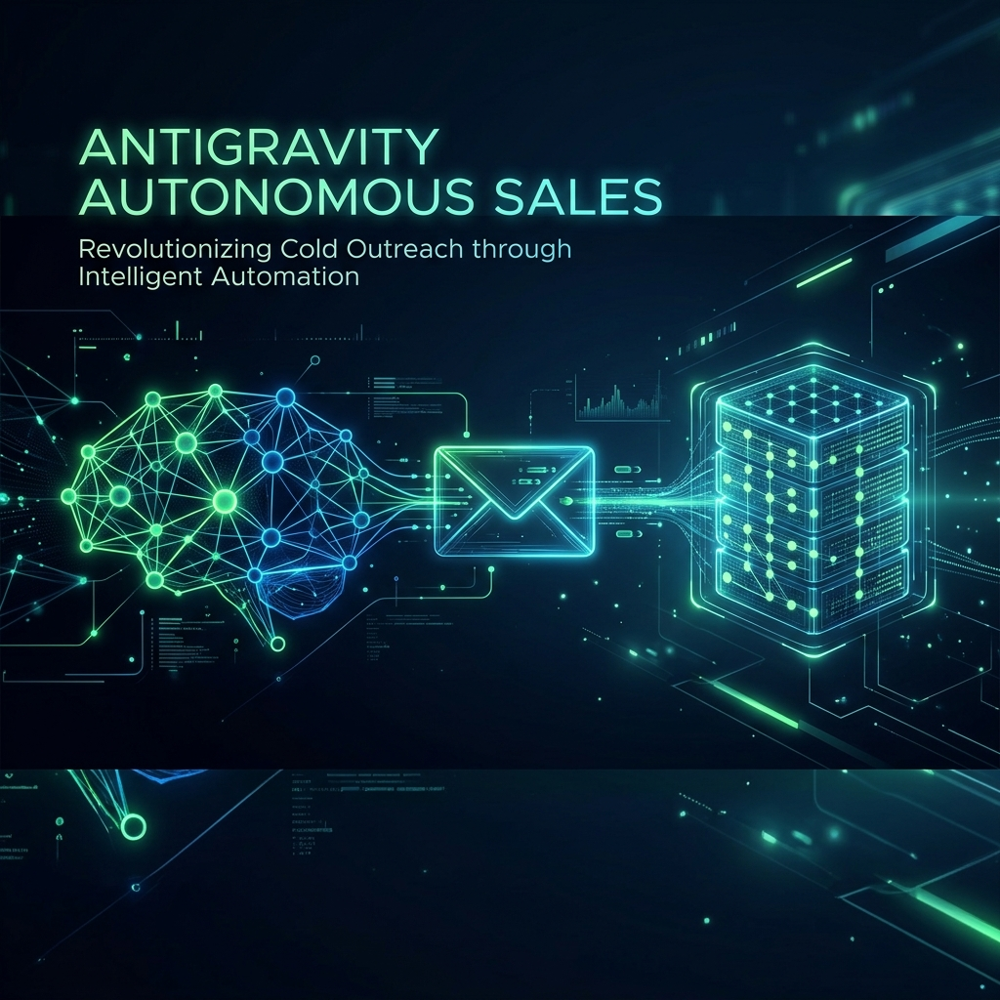

# Antigravity — Autonomous Sales Machine

<div align="center">

<br><br>

[](https://python.org)
[](LICENSE)
[](https://github.com/MarMasher/antigravity-autonomous-sales/stargazers)

**A fully autonomous, self-healing AI pipeline that finds small business leads, audits their websites, and sends personalized cold outreach — while you sleep.**

[Quick Start](#quick-start) · [Architecture](#architecture) · [Configuration](#configuration) · [Agents](#agents) · [Contributing](#contributing)

</div>

---

## What It Does

Antigravity runs an advanced 8-agent pipeline, orchestrated autonomously:

| Step | Agent | What happens |
|------|-------|-------------|
| 1 | **Supervisor** | The core orchestrator. Plans the execution sequence and coordinates data hand-offs between specialized agents. |
| 2 | **Apify Lead Agent** | Leverages Apify to scrape mapping data and rapidly aggregate massive lists of high-intent local business leads. |
| 3 | **Researcher** | Sweeps niches/cities, scrapes contacts, audits websites, and scores leads by buyer quality and website pain. |
| 4 | **Video Auditor** | Generates an automated, personalized Loom-style video teardown of the lead's website with voiceover logic. |
| 5 | **Builder** | Generates a live demo site (deployed to Vercel/GitHub Pages) perfectly personalized to the lead's business. |
| 6 | **Outreach** | Writes a human-sounding cold DM/email linking the video teardown and demo site, ready to send. |
| 7 | **Reply Processor** | Reads your Gmail inbox, classifies inbound replies (YES / PRICE / NO), and auto-responds to keep the deal warm. |
| 8 | **Negotiator** | Given the owner's reply, generates the optimal negotiation response with pricing, reasoning, and next steps. |

**Self-healing:** If any agent crashes, AutoHealer identifies the failing file, sends it to an LLM for a fix, patches the file, reloads the module, and retries — all without human intervention.

---

## Quick Start

### 1. Clone & install

```bash
git clone https://github.com/MarMasher/antigravity-autonomous-sales.git
cd antigravity-autonomous-sales

python -m venv .venv
# Windows:
.venv\Scripts\activate
# macOS/Linux:
source .venv/bin/activate

pip install -r requirements.txt
```

### 2. Configure secrets

```bash
cp .env.example .env
```

Open `.env` and fill in your credentials. See [Configuration](#configuration) for details.

### 3. Run

```bash
# Single pipeline run (research 10 leads + outreach)
python run.py

# Run the full daemon (repeats every 24 hours)
python daemon.py

# Or double-click START_DAEMON.bat on Windows
```

### 4. Watch the dashboard

```bash
python orchestrator.py status
```

---

## Architecture

```
daemon.py  ── orchestrates all agents in sequence, every 24h
    │
    ├── agents/supervisor.py       (Pipeline orchestration & data hand-offs)
    ├── agents/apify_lead_agent.py (Scale lead scraping via Apify)
    ├── agents/researcher.py       (Lead discovery + scoring)
    ├── agents/builder.py          (Live demo site generation)
    ├── agents/outreach.py         (Cold DM generation)
    ├── agents/video_auditor.py    (Screen-capture audit emails)
    ├── agents/negotiator.py       (Reply → negotiation response)
    │
    ├── utils/email_sender.py      (Gmail SMTP outreach)
    ├── utils/reply_processor.py   (Gmail IMAP + auto-reply)
    ├── utils/auto_healer.py       (Self-healing via AI patch loop)
    ├── utils/llm_client.py        (Generic OpenAI-compatible AI client)
    ├── utils/github_client.py     (GitHub API for demo repos)
    └── utils/state_manager.py     (Persistent JSON state)
```

**State machine:** All agents share `shared_state.json` (git-ignored). This file tracks targets, outreach history, conversations, and closed-lost leads across cycles.

---

## Configuration

Copy `.env.example` to `.env` and configure:

### Required

| Variable | Description |
|----------|-------------|
| `LLM_API_KEY` | Your AI provider API key (OpenAI, Anthropic, Groq, local, etc) |
| `LLM_BASE_URL` | Base URL for OpenAI-compatible endpoint (e.g. `https://api.openai.com/v1`) |
| `LLM_MODEL_PRIMARY` | Primary model ID (e.g. `gpt-4o-mini`, `llama3-70b`) |
| `LLM_MODEL_FALLBACK` | Fallback model ID in case of rate limits |
| `EMAIL_FROM` | Your Gmail address |
| `GMAIL_APP_PASSWORD` | Gmail App Password ([how to get one](https://support.google.com/accounts/answer/185833)) |
| `EMAIL_TO` | Your email for receiving lead dossiers |
| `GITHUB_TOKEN` | GitHub Personal Access Token (for repo creation) |
| `GITHUB_USERNAME` | Your GitHub username |

### Identity (shown in outreach emails)

| Variable | Description |
|----------|-------------|
| `SENDER_NAME` | Your name (used in email signatures) |
| `SENDER_HANDLE` | Your social handle (e.g. `@yourhandle`) |

### Optional

| Variable | Default | Description |
|----------|---------|-------------|
| `SEND_OUTREACH_EMAILS` | `false` | Set `true` to enable autonomous cold emails |
| `OUTREACH_MAX_PER_CYCLE` | `50` | Max cold emails per cycle |
| `OUTREACH_SCORE_THRESHOLD` | `10` | Min score to receive outreach |
| `OUTREACH_PRICE` | `$1,500` | Price quoted in outreach templates |
| `APIFY_TOKEN` | — | For Apify-powered lead scraping |
| `VERCEL_TOKEN` | — | For Vercel deployment of demo sites |

---

## Agents

### Supervisor
The core orchestrator of the entire pipeline. It organizes the sequence of execution, guarantees successful state transitions between agents, and enforces email quality constraints (filtering out AI glitches, repeating text, or generic apologies).

### Apify Lead Agent
Leverages the Apify Actor API to scrape high-intent local business leads via Google Maps. It rapidly aggregates structured mapping data, bypassing local IP blocks, making it capable of pulling thousands of businesses in minutes.

### Researcher
Sweeps `70+ niches × 150+ cities` using DuckDuckGo. Scores leads on a **two-axis system**:
- **Buyer Quality (0–40):** Social presence, phone, email, reviews, credibility signals
- **Website Pain (0–30):** Low score, no mobile, no SSL, slow load, no meta

Only businesses with HIGH quality AND HIGH pain are selected — the best ROI for cold outreach.

### Builder
For each top lead, generates a complete 4-page Puter.js website (Home, Services, About, Contact) with the business's real name, niche, and location. Deploys to GitHub Pages and creates a Vercel live URL.

### Reply Processor
IMAP-reads your Gmail inbox every cycle. Classifies unread replies from known leads using regex + AI. Auto-replies with:
- **YES** → CSS snippet attachment + full-site upsell
- **PRICE** → Flat fee quote + mockup offer
- **NO** → Polite farewell, marks Closed-Lost in state

### Negotiator
Interactive CLI agent. Paste in an owner's reply, get: recommended response (copy-paste ready), reasoning, signals to watch for, and next steps.

```bash
python orchestrator.py negotiate
```

### AutoHealer
Wraps every agent call. On crash:
1. Identifies the failing source file from the traceback
2. Reads the file and sends it to your configured LLM models with the error
3. AI returns the complete fixed file
4. Validates it compiles (AST parse)
5. Backs up original, patches, reloads the module
6. Retries — up to 3 times

---

## CLI Reference

```bash
# Run the full pipeline (research + outreach)
python run.py

# Specify number of targets
python run.py --targets 5

# Skip research, use existing state targets
python run.py --skip-research

# Run continuously (every 24h)
python run.py --loop

# Orchestrator CLI commands
python orchestrator.py status        # Live pipeline status
python orchestrator.py negotiate     # Negotiator interactive mode
python orchestrator.py reset         # Reset state

# Windows Task Scheduler setup (runs at 8AM daily)
powershell -File schedule_task.ps1
```

---

## Contributing

1. Fork the repository
2. Create a feature branch: `git checkout -b feature/my-feature`
3. Commit your changes: `git commit -m 'Add my feature'`
4. Push to the branch: `git push origin feature/my-feature`
5. Open a Pull Request

Please read [CONTRIBUTING.md](CONTRIBUTING.md) for code style and testing guidelines.

---

## License

MIT © 2026 — see [LICENSE](LICENSE) for details.

> **Disclaimer:** Use responsibly. Ensure your cold outreach complies with CAN-SPAM, GDPR, and applicable local laws. The authors are not responsible for misuse.
